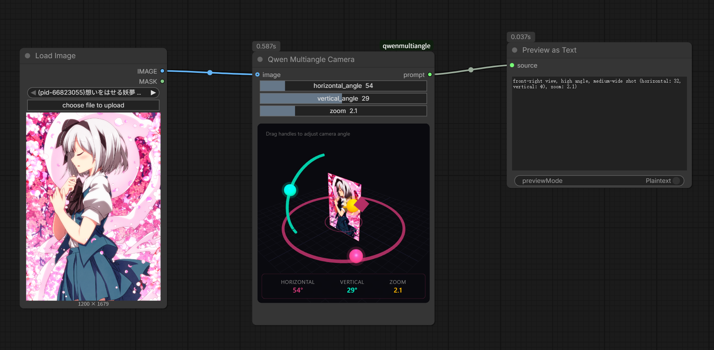

# tk_comfyui_view_and_light (ComfyUI Custom Node)

**Language / 语言 / 言語 / 언어:** [English](README.md) | [中文](README_zh.md) | [日本語](README_ja.md) | [한국어](README_ko.md)

A powerful ComfyUI custom node that combines interactive 3D camera visualization with advanced lighting control. It outputs formatted prompt strings compatible with multi-angle and lighting-aware models.



## 🌟 Key Features

### 1. Interactive 3D Camera Control
Adjust your scene's perspective using a Three.js-powered interactive viewport:
- **Azimuth (Horizontal):** 0° - 360°
- **Elevation (Vertical):** -90° to 90°
- **Zoom (Distance):** 0.0 - 10.0
- **Quick Presets:** Dropdown menus for common angles (Front, Side, Back) and distances (Close-up, Medium, Wide).
- **Two-Way Sync:** Sliders, 3D handles, and dropdowns stay perfectly in sync.

### 2. Advanced Lighting Control
Precisely position light sources in 3D space:
- **Enable/Disable Lighting:** Toggleable lighting prompt generation.
- **Light Position:** Independent horizontal and vertical angle controls for the light source.
- **Color Selection:** Specify light color via hex code (e.g., `#FFFFFF`).
- **Visual Feedback:** The 3D viewer displays a light bulb indicator that matches your selected color and position.

### 3. Real-time Preview & Camera Mode
- **Image Input:** Connect an image to see it rendered as a card in the 3D scene.
- **Camera View Mode:** Toggle to see the exact perspective your settings define, with OrbitControls for intuitive navigation.

### 4. Smart Prompt Generation
Outputs two separate strings:
- **Camera Prompt:** Formatted for compatibility with [Qwen-Image-Edit-2511-Multiple-Angles-LoRA](https://huggingface.co/fal/Qwen-Image-Edit-2511-Multiple-Angles-LoRA).
- **Light Prompt:** Descriptive lighting strings (e.g., `(light source from the Rear, Above), #FFD700 colored light`).

---

## 🚀 Installation

1.  Navigate to your ComfyUI custom nodes directory:
    ```bash
    cd ComfyUI/custom_nodes
    ```

2.  Clone this repository:
    ```bash
    git clone https://github.com/tack1031/tk_comfyui_view_and_light.git
    ```

3.  Restart ComfyUI.

---

## 🛠 Usage

1.  Find the node under **TK Nodes** > **TK View & Light**.
2.  **Camera Setup:** Use the 3D handles or sliders to set your camera angle.
3.  **Lighting Setup:** Enable lighting and adjust the light source position/color.
4.  **Connect Outputs:**
    - `camera_prompt`: Connect to your prompt builder or LoRA loader.
    - `light_prompt`: Connect to your CLIP Text Encode or similar nodes for lighting influence.

---

## 🧪 Development

This project is built with **TypeScript** and **Vite** for the frontend, and **Python** for the ComfyUI backend.

### Requirements
- Node.js 18+
- npm

### Build Commands
```bash
npm install     # Install dependencies
npm run build   # Production build
npm run dev     # Development mode with watch
```

---

## 🙏 Special Thanks

This project is made possible thanks to the following open-source contributions:

- **[ComfyUI-qwenmultiangle](https://github.com/jtydhr88/ComfyUI-qwenmultiangle)** - For the excellent 3D camera widget implementation and Qwen LoRA integration.
- **[ComfyUI-AdvancedCameraPrompts](https://github.com/jandan520/ComfyUI-AdvancedCameraPrompts)** - For advanced camera prompt logic and technical inspirations.
- Originally inspired by [multimodalart](https://huggingface.co/spaces/multimodalart/qwen-image-multiple-angles-3d-camera) and [fal.ai](https://fal.ai/models/fal-ai/qwen-image-edit-2511-multiple-angles/).

---

## 👤 Author
Developed by **Tack**  
📧 [tack1031@gmail.com](mailto:tack1031@gmail.com)

---

## 📄 License
This project is licensed under the **MIT License**. See the `LICENSE` file for details.
